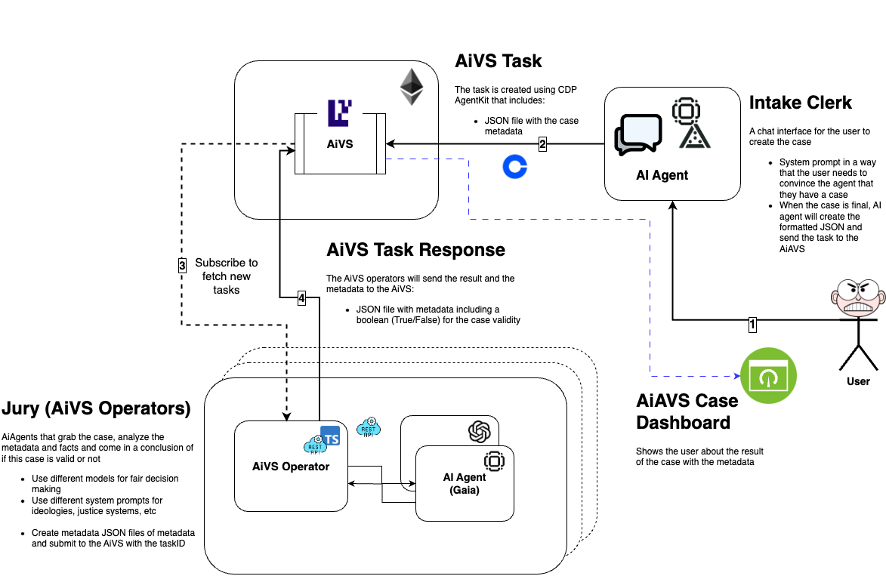

# AiVS Development Environment

## Prerequisites

1. Install [foundry](https://book.getfoundry.sh/getting-started/installation)

```bash
curl -L https://foundry.paradigm.xyz | bash
foundryup
```

2. Install [docker](https://docs.docker.com/get-docker/)

3. Install [Node.js](https://nodejs.org/) (v18 or later)

## Setup

1. Install project dependencies:

```bash
make install
```

2. Build the contracts:

```bash
make build-contracts
```

## Development

### Start Local Chain

Start anvil in a separate terminal with deployed contracts:

```bash
make start-anvil-chain-with-el-and-avs-deployed
```

### Start Services

Start the judge:

```bash
make start-judge
```

Register and start the juror:

```bash
make start-juror
```

## Available Commands

- `make install` - Install all dependencies
- `make build-contracts` - Build smart contracts
- `make start-anvil-chain-with-el-and-avs-deployed` - Start local chain
- `make clean` - Clean build artifacts
- `make test` - Run all tests
- `make format` - Format code
- `make lint` - Lint code

## Development Workflow

1. Start the local chain using the provided anvil state
2. Start the aggregator service
3. Register and start the operator
4. Make changes and use provided make commands for testing and validation

## Contributing

1. Ensure all tests pass: `make test`
2. Format code before committing: `make format`
3. Ensure linting passes: `make lint`

Commits follow [Conventional Commits](https://www.conventionalcommits.org/) specification.

## Project Architecture



This diagram illustrates the core components and interactions within our Incredible Squaring AVS:

- Smart Contracts: Manages task creation and service coordination
- Operator Service: Handles BLS signature generation and submission
- Aggregator: Collects and verifies operator responses
- EigenLayer Integration: Provides operator registration and staking functionality
