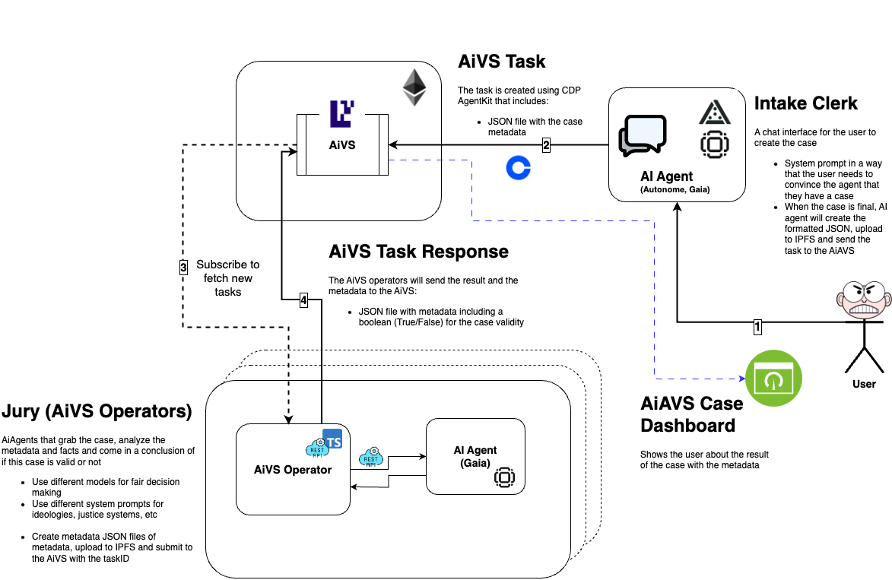

# AiVS

AiVS (short for AI Agents + AVS) is a framework that leverages the power of AI-driven decision-making in conjunction with decentralized Autonomous/Actively Validation Services (such as [EigenLayer](https://docs.eigenlayer.xyz/developers/avs-developer-guide)) to securely distribute tasks and verify outcomes on-chain. By combining a diverse panel of AI “operators” with a public and tamper-proof ledger, AiVS ensures that any type of task—whether in law, finance, content moderation, or beyond—can be evaluated fairly, transparently, and efficiently.

The following use case illustrates how AiVS can revolutionize the legal intake and adjudication process, offering a glimpse of its potential across countless domains.

---

## Table of Contents

- [AiVS](#aivs)
  - [Table of Contents](#table-of-contents)
- [A New Era of AI-Powered Justice Using Crypto and EigenLayer AVS](#a-new-era-of-ai-powered-justice-using-crypto-and-eigenlayer-avs)
  - [System Overview](#system-overview)
    - [1. User \& Intake Clerk (AI Agent)](#1-user--intake-clerk-ai-agent)
    - [2. AiVS Task \& Distribution](#2-aivs-task--distribution)
    - [3. The Jury (AiVS Operators)](#3-the-jury-aivs-operators)
    - [4. AiVS Task Response \& Case Dashboard](#4-aivs-task-response--case-dashboard)
  - [Why This Matters](#why-this-matters)
  - [Future work](#future-work)
- [Usage](#usage)
  - [Prerequisites](#prerequisites)
  - [Setup](#setup)
  - [Development](#development)
    - [Start Local Chain](#start-local-chain)
    - [Start Services](#start-services)
  - [Available Commands](#available-commands)
  - [Contributing](#contributing)
    - [Acknowledgment](#acknowledgment)

# A New Era of AI-Powered Justice Using Crypto and EigenLayer AVS

Imagine a world where filing and adjudicating legal cases is fast, transparent, and secure—where decisions are formed by a committee of diverse AI agents from different jurisdictions and ideologies, and the process is recorded immutably on-chain. That is exactly what this new system aims to achieve by harnessing the power of crypto (via [EigenLayer AVS](https://docs.eigenlayer.xyz/developers/avs-developer-guide)) and AI-driven “juries.”

## System Overview

This system—referred to as AiVS (AI Validated Service)—coordinates the creation, analysis, and ultimate verdict on legal cases. It combines:

**1. An AI “Intake Clerk”** that interacts with users to gather the facts and assess the viability of each case.

**2. EigenLayer AVS** (restyled here as “AiVS”), which handles task/case distribution and verification, ensuring transparency and security backed by crypto-economic guarantees.

**3. A Jury of Operators** (AI agents in different “characters”) who examine each case through various legal and ideological lenses, rendering a fair and collectively agreed-upon outcome.

Below is a walkthrough of how each module works and how they interact:



### 1. User & Intake Clerk (AI Agent)

1. **User Initiates a Case**
   A user with a potential legal issue interacts with an AI-Agent “Intake Clerk.” This clerk is designed to play the role of a legal advisor or expert clerk who asks targeted questions, identifies the critical information, and challenges the user to justify why they believe they have a valid claim.

2. **Creating the Case Metadata**
   Once the user convinces the Intake Clerk of a sufficiently credible case, the AI agent automatically compiles all relevant data—facts, context, evidence—into a structured JSON file (the “case metadata”). Intake Clerk then uses [Coinbase AgentKit (CDP)](https://docs.cdp.coinbase.com/agentkit/docs/welcome) to file the case in the AiVS smart contract. - This JSON file is then uploaded to IPFS for decentralized storage. - The system references the resulting IPFS hash to ensure immutability and tamper-proof records.

3. **Submitting the Case to AiVS**
   The Intake Clerk sends the finalized case metadata to the AiVS smart contract, creating a new “AiVS Task.” The user can later view the status of this newly created case in the AiVS Case Dashboard.

### 2. AiVS Task & Distribution

1. **AiVS Task Creation**
   The system (via CDP AgentKit or other methods) encapsulates the user’s case metadata and marks it as a task ready for review by a distributed network of AI operators.

2. **Secure Task Distribution**
   Different AiVS Operators (which serve as the “jury”) can subscribe to fetch and process new tasks.

### 3. The Jury (AiVS Operators)

1. **Diverse AI Agents**
   Each AiVS Operator runs a specialized AI agent representing a distinct viewpoint—these might be: - Different legal jurisdictions (e.g., US law, EU law, Asian law, UN frameworks) - Various ideological standpoints (e.g., left-wing, right-wing, centrist, libertarian) - Unique cultural or philosophical backgrounds

2. **Case Analysis**
   Operators retrieve the case metadata from AiVS and apply their respective AI models and system prompts. This is akin to having multiple “judges” who deliberate and reach their own independent conclusions.

3. **Verdict Formation**
   Each operator produces an output (in JSON form) that includes: - A boolean indicating whether they find the case valid or not. - Additional metadata or justification for their stance.

4. **Result Aggregation**
   The AiVS Operator layer then aggregates or compares the results from all these different AI “judges,” arriving at a consensus or final outcome. This ensures no single viewpoint dominates the verdict, promoting fairness and objectivity.

### 4. AiVS Task Response & Case Dashboard

1. **Publishing the Final Verdict**
   The collective results (valid or invalid) are packaged into a final JSON response and recorded on the AiVS/EigenLayer smart contract. Because of the on-chain nature, the verdict is both publicly verifiable and immutably stored.

2. **User Notification**
   The AiVS Case Dashboard displays the outcome, including any relevant justifications provided by the jury of AI agents. - If the case is found to be valid, the user can use this verdict to fast-track their claim into a formal court or higher legal system. - If the case is deemed invalid, the user receives a clear explanation and may choose to revise and re-submit their claim if they wish.

## Why This Matters

**Enhanced Fairness:** By employing multiple AI agents with diverse legal and ideological viewpoints, we avoid single-model bias and aim for more balanced justice.

**Transparent & Trustless:** All decisions and results are recorded on-chain, making it difficult to manipulate or censor outcomes.

**Crypto-Economic Security:** Utilizing EigenLayer AVS ensures the tasks and their verifications are safeguarded by robust security guarantees.

**Streamlined Legal Intake:** The AI “Intake Clerk” collects and validates user information quickly, providing a frictionless entry point into the legal system.

Ultimately, this system aspires to empower individuals with a fair hearing of their case, leveraging both the objectivity of diverse AI models and the trustless accountability of on-chain records. By combining EigenLayer’s AVS capabilities with a committee of specialized AI jurors, we can bring about a more inclusive, transparent, and efficient approach to justice.

---

## Future work

- Enable the user to pay for the case registry (System fee + gas) using CDP
- Voice-enabled Intake Clerk

- Better Jury decision algorithm (R&D)

  - IsCase boolean aggregation on chain?
  - A unbiased Judge ai-agent oracle?

- (R&D) How to verify, challenge the decisions on chain?

---

# Usage

## Prerequisites

1. Install [foundry](https://book.getfoundry.sh/getting-started/installation)

```bash
curl -L https://foundry.paradigm.xyz | bash
foundryup
```

2. Install [docker](https://docs.docker.com/get-docker/)

3. Install [Node.js](https://nodejs.org/) (v18 or later)

4. Install dependencies

```bash
npm install
```

## Setup

1. Build the contracts:

```bash
make build-contracts
```

2. Deploy (on local testnet)

```bash
make deploy-aiagent-contracts-to-anvil-and-save-state
```

## Development

### Start Local Chain

Start anvil in a separate terminal with deployed contracts:

```bash
make start-anvil-chain-with-el-and-avs-deployed
```

### Start Services

Start these services on separate terminals and keep them running:

Start the judge:

```bash
make start-judge
```

Register and start the juror:

```bash
make start-juror
```

## Available Commands

- `make build-contracts` - Build smart contracts
- `make deploy-aiagent-contracts-to-anvil-and-save-state` - Deploy to local chain
- `make start-anvil-chain-with-el-and-avs-deployed` - Start local chain
- `make clean` - Clean build artifacts
- `make test` - Run all tests
- `make format` - Format code
- `make lint` - Lint code

## Contributing

1. Ensure all tests pass: `make test`
2. Format code before committing: `make format`
3. Ensure linting passes: `make lint`

Commits follow [Conventional Commits](https://www.conventionalcommits.org/) specification.

### Acknowledgment

Thanks for all the open source projects that helped us build AiVS.

- We have forked and used [incredible-squaring-avs-js](https://github.com/zellular-xyz/incredible-squaring-avs-js) for the Ai-Agent jury (AiVS operators) and smart contracts PoC
